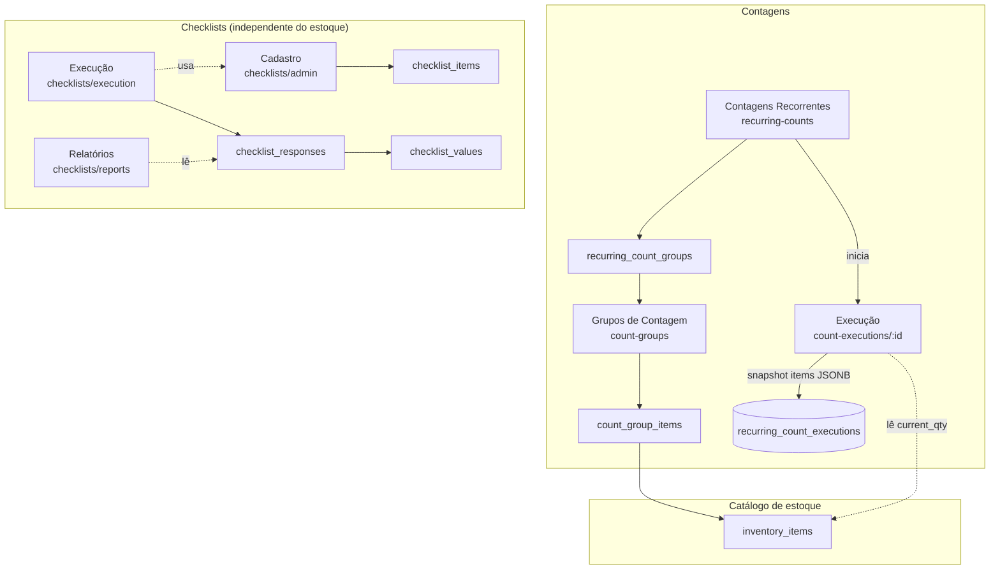

# Estoque — Contagens & Checklists

Documentação técnica dos módulos de **Grupos de Contagem**, **Contagens Recorrentes** e
**Checklists** do GrauOS (área `admin/stock`). Serve de base para evoluções e novas funções.

> Stack: Vite + React + TypeScript + shadcn/ui + React Query + Supabase (Postgres + RLS).
> Todos os dados são **multi-loja** (`store_id`); a loja atual vem de `useStore()` /
> `currentStore`. Autenticação/roles via `PrivateRoute` (`staff` < `manager` < ...).

---

## 1. Visão geral

| Módulo | Rota | Permissão | O que faz |
|---|---|---|---|
| **Grupos de Contagem** | `/admin/stock/count-groups` | `manager` | Agrupa itens do estoque em grupos nomeados (cor, frequência sugerida). É a base reutilizável para as contagens recorrentes. |
| **Contagens Recorrentes** | `/admin/stock/recurring-counts` | `manager` | Agenda contagens periódicas (diária/semanal/mensal) sobre um ou mais grupos, com responsável e horário; inicia execuções. |
| **Execução de Contagem** | `/admin/stock/count-executions/:id` | `staff` | Tela onde o operador de fato conta os itens (qtd contada × qtd do sistema) e finaliza a contagem. |
| **Checklists — Cadastro** | `/admin/stock/checklists/admin` | `manager` | Cria checklists operacionais (diário/semanal) e seus itens (sim/não, número, texto, foto). |
| **Checklists — Execução** | `/admin/stock/checklists/execution` | `staff` | Operador responde o checklist do dia; grava resposta + valores por item. |
| **Checklists — Relatórios** | `/admin/stock/checklists/reports` | `staff` | Histórico das respostas de checklists (quem, quando, o quê). |

Dois subsistemas independentes convivem aqui:

- **Contagens de estoque** (grupos → recorrência → execução): foco em conferir quantidades
  físicas × sistema.
- **Checklists operacionais** (cadastro → execução → relatórios): foco em rotinas/conformidade
  (abertura, limpeza, temperatura etc.), **não** ligadas a itens de estoque.

---

## 2. Modelo de dados

Definições em `supabase/migrations/20260420000000_inventory_phase2.sql` (grupos + checklists)
e `ADD_RECURRING_COUNTS.sql` (recorrência). Todas com RLS habilitada.

### Contagens

```
inventory_items (catálogo base — id, name, unit, current_qty, ...)
        ▲
        │ (N:N)
inventory_count_group_items (group_id, item_id)   ← PK composta
        ▲
        │
inventory_count_groups (id, store_id, name, description, color,
                        frequency_days, is_active)
        ▲
        │ (N:N)
inventory_recurring_count_groups (recurring_count_id, group_id)
        ▲
        │
inventory_recurring_counts (id, store_id, name, recurrence_type,
                            weekdays[], notification_time,
                            responsible_id, responsible_name, is_active)
        │
        ▼ (1:N)
inventory_recurring_count_executions (id, recurring_count_id, store_id,
                                      status, executed_by, executed_at,
                                      items JSONB, notes)
```

- `inventory_count_schedule` (id, store_id, group_id, scheduled_date, status, user_id,
  completed_at) existe na migration como agenda por grupo, mas o fluxo em produção usa
  `inventory_recurring_counts` — tratar `count_schedule` como legado/alternativo ao evoluir.
- `items` (JSONB) da execução guarda o **snapshot** de cada item contado:
  `{ item_id, item_name, unit, system_qty, counted_qty, diff }`.

### Checklists

```
inventory_checklists (id, store_id, name, description,
                      frequency 'daily'|'weekly', is_active)
        │
        ▼ (1:N)
inventory_checklist_items (id, checklist_id, name,
                           type 'boolean'|'number'|'text'|'photo',
                           is_required, sort_order)

inventory_checklist_responses (id, checklist_id, store_id, user_id,
                               status, completed_at, date_reference)
        │
        ▼ (1:N)
inventory_checklist_values (id, response_id, item_id,
                            value_text, value_boolean, value_number, photo_url)
```

Função auxiliar: `get_next_monday()` (usada no agendamento semanal).

---

## 3. Detalhe por módulo

### 3.1 Grupos de Contagem — `CountGroupsPage.tsx`
- **Rota/permissão:** `/admin/stock/count-groups` · `manager`.
- **O que faz:** CRUD de grupos (`inventory_count_groups`) e associação de itens do estoque
  ao grupo (`inventory_count_group_items` ↔ `inventory_items`). Cada grupo tem nome, cor,
  descrição e `frequency_days` (frequência sugerida).
- **Também exibe** o uso do grupo pelas contagens recorrentes (consulta
  `inventory_recurring_counts`, `inventory_recurring_count_groups` e
  `inventory_recurring_count_executions`) — por isso a página toca essas tabelas além das próprias.
- **Papel na integração:** é o "bloco de montagem" reutilizado pelas contagens recorrentes.

### 3.2 Contagens Recorrentes — `RecurringCountsPage.tsx`
- **Rota/permissão:** `/admin/stock/recurring-counts` · `manager`.
- **O que faz:**
  1. CRUD de contagens recorrentes (`inventory_recurring_counts`): tipo de recorrência
     (`daily|weekly|monthly`), `weekdays[]` (0=Seg…6=Dom), horário de notificação, responsável,
     ativo/inativo.
  2. Vincula os **grupos** de contagem à recorrência (`inventory_recurring_count_groups`).
  3. **Inicia uma execução:** insere um registro em `inventory_recurring_count_executions`
     com `status='in_progress'` e navega para `/admin/stock/count-executions/:id`.
- **Depende de** `inventory_count_groups` (para escolher os grupos) e `user_profiles`
  (para o responsável).

### 3.3 Execução de Contagem — `RecurringCountExecutionPage.tsx`
- **Rota/permissão:** `/admin/stock/count-executions/:id` · `staff`.
- **O que faz:**
  1. Carrega a execução, os grupos vinculados e os **itens** de cada grupo
     (`inventory_count_group_items` → `inventory_items(id, name, unit, current_qty)`).
  2. Operador digita a quantidade contada por item.
  3. Ao finalizar, monta o snapshot `items` (`system_qty` = `inventory_items.current_qty`,
     `counted_qty` = digitado, `diff` = contado − sistema) e faz `update` na execução com
     `status='completed'` + `executed_at` + `items` (JSONB).
- **⚠️ Importante:** a contagem **não** grava em movimentações nem ajusta o saldo do estoque —
  é um **snapshot para conferência/divergência**. Ajuste de estoque (se desejado) seria uma
  evolução (ver §5).

### 3.4 Checklists — Cadastro — `ChecklistAdminPage.tsx`
- **Rota/permissão:** `/admin/stock/checklists/admin` · `manager`.
- **O que faz:** CRUD de checklists (`inventory_checklists`, `frequency` daily/weekly) e de seus
  itens (`inventory_checklist_items`, `type` boolean/number/text/photo, `is_required`,
  `sort_order`).

### 3.5 Checklists — Execução — `ChecklistExecutionPage.tsx`
- **Rota/permissão:** `/admin/stock/checklists/execution` · `staff`.
- **O que faz:** operador seleciona um checklist, responde os itens e grava uma resposta
  (`inventory_checklist_responses`, com `date_reference` = dia) + um valor por item
  (`inventory_checklist_values`: texto/booleano/número/foto conforme o tipo).

### 3.6 Checklists — Relatórios — `ChecklistReportsPage.tsx`
- **Rota/permissão:** `/admin/stock/checklists/reports` · `staff`.
- **O que faz:** lista o histórico de respostas (`inventory_checklist_responses`, com joins para
  checklist/usuário) para auditoria — quem preencheu, quando, qual checklist.

---

## 4. Como os módulos se integram



**Fluxo de contagem (ponta a ponta):**
`itens do estoque` → agrupados em **Grupos de Contagem** → um **Contagem Recorrente** referencia
grupos e agenda → ao rodar, cria uma **Execução** → operador conta → snapshot com divergências
fica salvo para conferência.

**Checklists** são um subsistema paralelo (rotinas operacionais), sem vínculo com itens de estoque;
compartilham apenas `store_id` e `user_id`.

---

## 5. Observações para evolução

Pontos que hoje **não existem** e são candidatos naturais a melhorias:

1. **Contagem não ajusta o estoque.** A execução só grava o snapshot (`diff`). Uma evolução seria,
   ao finalizar, gerar movimentação de ajuste em `inventory_movements`/atualizar `current_qty`
   (com confirmação do gestor), fechando o ciclo de inventário.
2. **Relatório de divergências de contagem.** Existe o dado (`items` JSONB com `diff`), mas não há
   uma tela dedicada de análise de divergências por período/grupo/loja (equivalente ao
   `checklists/reports`, mas para contagens).
3. **Notificações/agendamento automático.** `recurrence_type`, `weekdays[]` e `notification_time`
   estão modelados, mas disparo automático (push/edge function) deve ser conferido/implementado —
   hoje o início da execução é manual pela tela.
4. **`inventory_count_schedule` legado.** Coexiste com `inventory_recurring_*`. Ao evoluir,
   decidir consolidar num único modelo de agenda para evitar caminhos duplicados.
5. **Checklists sem alertas de não conformidade.** `is_required` e tipos existem, mas não há
   bloqueio/alerta quando um item obrigatório falha (ex.: temperatura fora da faixa).

## 6. Arquivos-chave

| Camada | Arquivos |
|---|---|
| Rotas | `src/App.tsx` (`/admin/stock/...`) |
| Páginas | `src/pages/admin/stock/{CountGroupsPage, RecurringCountsPage, RecurringCountExecutionPage, ChecklistAdminPage, ChecklistExecutionPage, ChecklistReportsPage}.tsx` |
| Schema | `supabase/migrations/20260420000000_inventory_phase2.sql`, `ADD_RECURRING_COUNTS.sql` |
| Contexto | `src/contexts/StoreContext.tsx` (`currentStore`), `AuthContext.tsx` (roles) |
